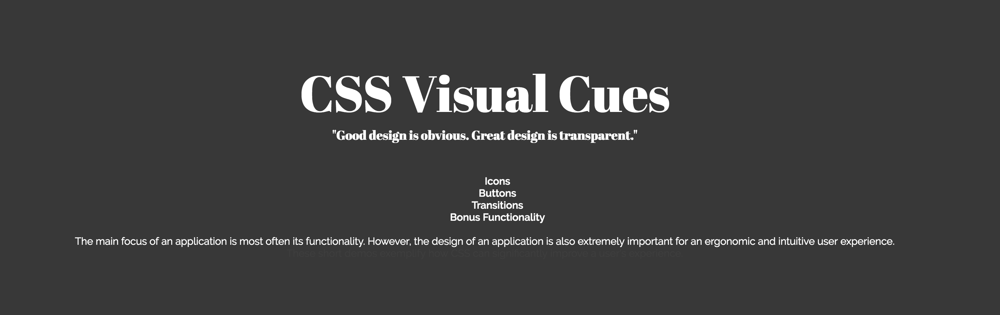
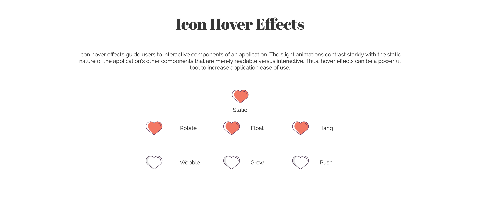

# CSS Visual Cues
[Live Link][live-link]
[live-link]: http://toniihsia.github.io

CSS Visual Cues is an interactive web application that features a number of intermediate and advanced CSS styles. The purpose of these CSS demos is to not only highlight the power of CSS, but also to highlight the importance of CSS in relation to UI/UX.

CSS Visual Cues uses HTML5 and pure CSS to create interactive effects.

## Features & Implementation
### Icon Hover Effects

The Icon Hover Effect section of CSS Visual Cues focuses on icon animations. The icon animations were made using pure CSS manipulations of x-, y-, and z-planes. Custom animations were coded to transform and translate icon positions and sizes in order to create effects such as rotating, floating, hanging, wobbling, growing, and pushing.

### Button Effects
The Button Effects section of CSS Visual Cues focuses on CSS hover and click effects. The button effects were created using pure CSS manipulations of static and active buttons. Subtle changes include that of changing the cursor to a pointer when buttons are hovered over to signal its clickability. More dramatic changes include that of manipulating button size, hover, and active events. Translations on the y-axis created 3-D visual aids that signaled whether a button existed and/or was pushed or not.

### Transition Effects
The Transition Effects section of CSS Visual Cues focuses on image transitions, mainly vertical and horizontal flips. A back and front face of an object were emulated through the use of two stacked `div`s which were manipulated using x- and y-plane rotations.

### Bonus Features
The Bonus Features section features a 3D Cube which expands upon hover. The 3D Cube and its expansion animation is made using pure CSS manipulations of x-, y-, and z-planes. Similarly to the objects used in Transition Effects, HTML `div`s are used to create sides. However, these HTML `div`s are merely stacked on top of each other and require not only rotations, but also translations.

Each flat `div` is rotated in order to create front, back, top, bottom, right, and left faces. z-plane transformations push these planes out in order to create 3-D space. Custom animations were coded in order to further expand the cube's sides and display even more space.

## Future Directions
### More 3D Manipulation
I would like to give more step=by-step examples of how 3-D space is achieved using CSS.
