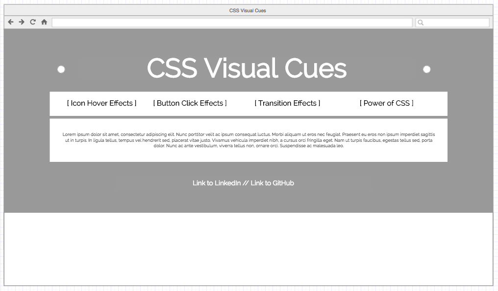

# CSS Visual Cues
## Background
Visual Cues emphasizes the importance of CSS styling for user interaction and experience.

The project will compare plain, un-styled elements with CSS styled elements to illustrate how visual cues can greatly enhance the ergonomics of a web service. The use of side-by-side visual demonstrations as well as a brief text descriptions of the effects each styled element has on a user will be the main feature of this application.

## Functionality & MVP
With CSS Visual Cues, user will be able to compare/contrast:
- [x] Icon Hover Effects
  - [x] Wobble
  - [x] Rotate
  - [X] Hang
  - [x] Float
  - [x] Grow
  - [x] Push
- [ ] Button Effects (2x)
  - [ ] Pressed Effect
  - [ ] Hover Effect
- [ ] Transition Effects (2x)
  - [x] Flip
  - [x] Slide
- [x] 3D Cube

## Wireframes
This will be a one-page web application. It contains nav links to different sections within the application itself as well as my own GitHub and LinkedIn accounts.

Each section of the web application will feature a different CSS styling technique. It will compare and contrast unstyled and styled elements to emphasize the impact styling can have on UI/UX. Some textual information on these effects will also be placed underneath each example.

After more practical examples of CSS styling, I will also include a section on the power of CSS which displays how one can use CSS to create and manipulate 3D Cubes.
![3-D Cube][wireframes/3d-cube.png]

## Architecture and Technologies
This project will be implemented with the following technologies:
- HTML
- CSS

## Implementation Timeline
**Day 1**: General set-up and learning of CSS. Begin working on icon hover effects.
  - Set up file system and GitHub Pages.
  - Learn about CSS x-, y-, and z-planes as well as their interactions.
  - Create basic web-page structure.
  - Start on Icon Hover Effects.

**Day 2**: Finish up icon hover effects, brush up on CSS knowledge, and continue onto button effects. Start on transition effects.
  - Finish Icon Hover Effects.
  - Create Button effects.
  - Brush up on x-, y-, and z-planes.
  - Start Transition Effects using brushed up knowledge.

**Day 3**: Finish up transition effects and begin 3D Cube.
  - Finish Transition Effects.
  - Begin 3D Cube.

**Day 4**: Finish up 3D Cube.
  - Dedicate entire day to 3D Cube.

## Bonus Features
- Add code snippets.
- Add 3D parallelogram.
- Add rotations.
